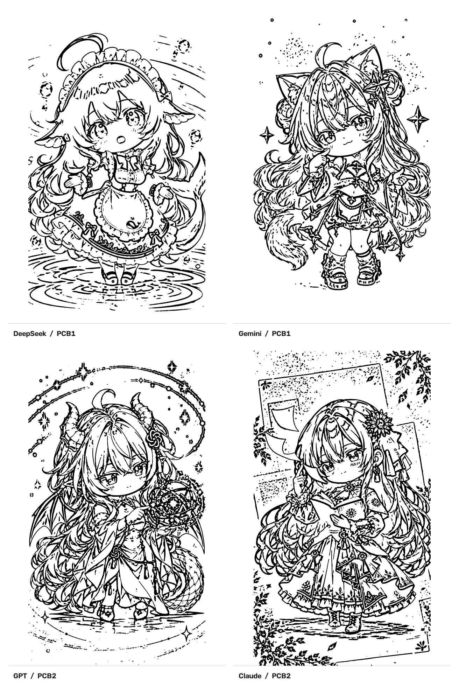
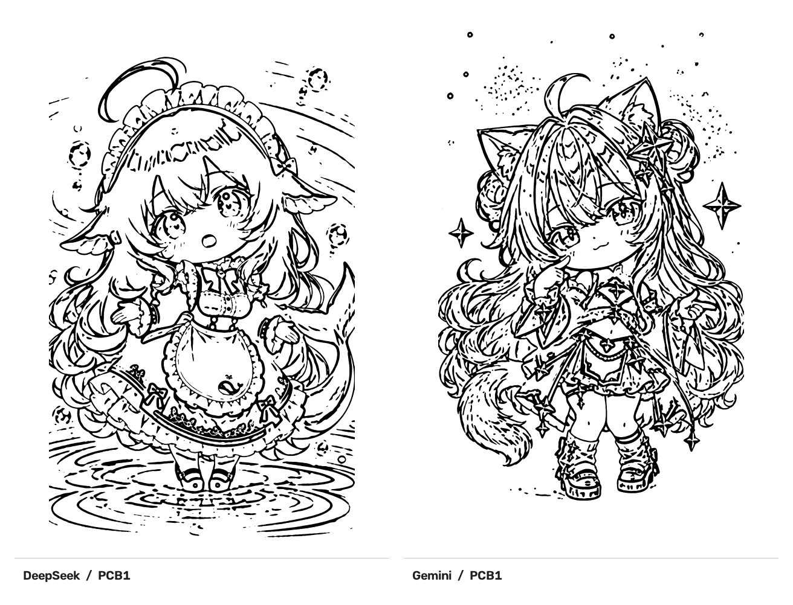
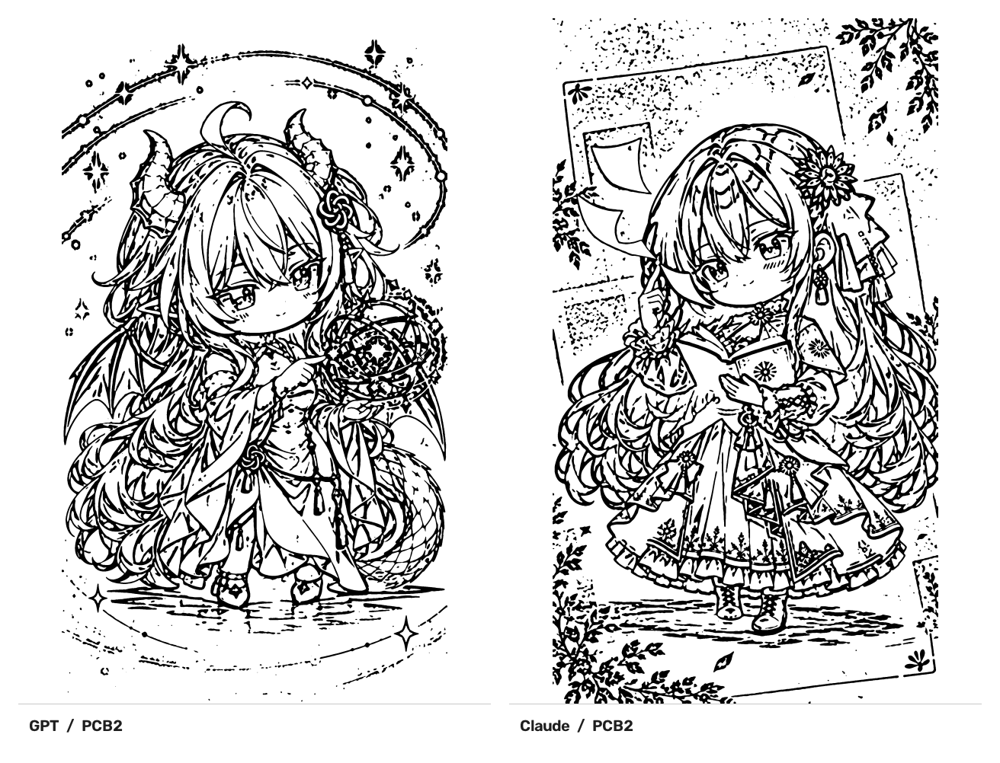

# AI-PCB-Art

> 🐳 四个 AI 拟人角色的**艺术纪念 PCB**：嘉立创EDA 开源工程、双面彩色丝印 + 沉金工艺、无电气功能，纯收藏向工艺板。

[](https://creativecommons.org/licenses/by-nc-sa/4.0/)
[](https://www.gnu.org/licenses/gpl-3.0.html)
[](https://pro.lceda.cn/)

---

## 📖 项目简介

本项目把 **DeepSeek / Gemini / GPT / Claude** 四个 AI 拟人化角色做成 **2 块艺术纪念 PCB**：

- **每块板正反两面各一个角色**，双面图案不同；
- **无任何电气功能**——无器件、无网络、无走线，纯靠 PCB 板厂工艺输出插画；
- 采用 **双面彩色丝印**（承载彩色插画主体）+ **沉金镀层**（金色，做轮廓、Logo、文字）组合出层次感；
- 板形为 **60 mm × 100 mm 竖向圆角卡片**（圆角 R4 mm），可作收藏摆件、挂件、桌面装饰。

> 📌 本项目是**爱好者个人作品**：作者只是 AI 拟人形象的爱好者，
> 出于对四个 AI 拟人角色设计（原设计者 [ZipZipPipe](https://space.bilibili.com/4168597)）
> 与开源 PCB 艺术（[@alsunmengy](https://github.com/alsunmengy)）的喜爱而做的纪念性硬件二创。
> **非商业项目，与四家 AI 公司及其运营主体无任何官方关联。**

## 🔩 板面与角色对应（重点）

**两块板、四个面、四个角色，一一对应如下**：

| 板 | 面 | 角色 | 线稿文件 | 彩色原设计参考 |
|----|-----|------|----------|----------------|
| **PCB1** | 正面 | **DeepSeek**（鲸鱼娘 · 蓝发女仆） | `源素材/线稿原图/01-DeepSeek.png` | `源素材/AI-Fanworks/ApprenTice/references/DeepSeek-Girl.png` |
| **PCB1** | 反面 | **Gemini**（紫蓝双马尾 · 猫耳星光） | `源素材/线稿原图/02-Gemini.png` | `源素材/AI-Fanworks/ApprenTice/references/Gemini-Girl.png` |
| **PCB2** | 正面 | **GPT / ChatGPT**（白发角 · 龙尾云端） | `源素材/线稿原图/03-GPT.png` | `源素材/AI-Fanworks/ApprenTice/references/ChatGPT-Girl.png` |
| **PCB2** | 反面 | **Claude**（橙发 · 抱书少女） | `源素材/线稿原图/04-Claude.png` | `源素材/AI-Fanworks/ApprenTice/references/Claude-Girl.png` |

对应的工程与生产文件：

| 板 | 工程源文件 | Gerber 生产包 |
|----|-----------|--------------|
| **PCB1**（DeepSeek + Gemini） | `工程源文件/deepseek_gemini.eprj2` | `Gerber/Gerber_PCB1_2026-10-05.zip` |
| **PCB2**（GPT + Claude） | `工程源文件/gpt_claude.eprj2` | `Gerber/Gerber_PCB2_2026-10-05.zip` |

> 💡 工程文件名已直接体现配对关系：`deepseek_gemini` = PCB1，`gpt_claude` = PCB2。



---

## 🗂️ 项目信息

| 项目 | 内容 |
|------|------|
| 仓库名 | `AI-PCB-Art` |
| 维护者 | [@wangyz666888](https://github.com/wangyz666888)（AI 拟人形象爱好者） |
| 设计工具 | 嘉立创EDA 专业版（EasyEDA Pro）v3.2.149 |
| 文件版本 | 2026-10-05 |
| 仓库体积 | 约 166 MB（93 个文件） |
| 美术素材协议 | CC BY-NC-SA 4.0 + 附加许可条款 |
| 工具代码协议 | GPL-3.0（见 `tools/`） |

---

## 🎨 预览

### 角色形象与线稿对照

左为**彩色原设计参考**（来自 `源素材/AI-Fanworks/`，原设计者 ZipZipPipe，由 ApprenTice 绘制），
右为**本项目用于 PCB 的二值化线稿**：

<table>
  <tr>
    <th>角色</th><th>彩色原设计参考</th><th>PCB 用二值化线稿</th><th>板 / 面</th>
  </tr>
  <tr>
    <td><b>DeepSeek</b><br><sub>鲸鱼娘 · 蓝发女仆</sub></td>
    <td></td>
    <td></td>
    <td>PCB1<br>正面</td>
  </tr>
  <tr>
    <td><b>Gemini</b><br><sub>紫蓝双马尾 · 猫耳星光</sub></td>
    <td></td>
    <td></td>
    <td>PCB1<br>反面</td>
  </tr>
  <tr>
    <td><b>GPT / ChatGPT</b><br><sub>白发角 · 龙尾云端</sub></td>
    <td></td>
    <td></td>
    <td>PCB2<br>正面</td>
  </tr>
  <tr>
    <td><b>Claude</b><br><sub>橙发 · 抱书少女</sub></td>
    <td></td>
    <td></td>
    <td>PCB2<br>反面</td>
  </tr>
</table>

### 每块板双面

<table>
  <tr>
    <td align="center"><b>PCB1（DeepSeek + Gemini）</b></td>
    <td align="center"><b>PCB2（GPT + Claude）</b></td>
  </tr>
  <tr>
    <td></td>
    <td></td>
  </tr>
</table>

### 设计画布与下单截图

| 文件 | 说明 |
|------|------|
| `截图/画布-人鱼少女主题卡.png` | 嘉立创EDA 画布中的主题卡面效果 |
| `截图/画布-金色描边少女卡片.png` | 嘉立创EDA 画布中的金色描边卡片效果 |
| `截图/下单-在线下单页.png` | 嘉立创下单页「基本信息 / PCB工艺」参数 |
| `截图/下单-参数检查.png` | 下单前「参数检查」面板 |

---

## 🧬 设计来源与授权链

本项目的角色形象**不是原创**，而是对既有社区同人拟人设计的**硬件化再创作**。完整授权链如下，请在使用本仓库前理解这一点：

```
① 原设计者  ZipZipPipe（B 站）
   作品：《大 AI 与小 AI 们》
   原视频：https://www.bilibili.com/video/BV1tE9XBbErS/
   主页：https://space.bilibili.com/4168597
   版权声明：依 CC BY-NC-SA 4.0 非商业使用，二创同协议授权
     └─ 其中 DeepSeek 鲸鱼娘：角色原案「上善无形」，ZipZipPipe 二次设计
                ↓  基于原作二次创作
② 绘制者    ApprenTice（B 站 space.bilibili.com/634972797）
   └─ AI-Fanworks 仓库（作者 / 上传者：Apprentice-Geo）
      仓库：https://github.com/Apprentice-Geo/AI-Fanworks
      作品视频：https://www.bilibili.com/video/BV1zXHe6nESu/
      └─ 仓库中 ApprenTice/ 目录的角色改编图像，依 CC BY-NC-SA 4.0 授权
         要求：转载请保留署名、来源及许可证信息，二次创作须遵循相同许可证
                ↓  用于 PCB 设计
③ 本项目    wangyz666888
   └─ AI-PCB-Art：把上述形象转成 PCB 工艺可行的二值化线稿 + 嘉立创EDA 工程
      依 CC BY-NC-SA 4.0 + 附加许可条款发布，保留上游全部署名
```

> 📌 本项目的四个角色形象均来自 ZipZipPipe 原作《大 AI 与小 AI 们》的社区二创体系；
> AI-Fanworks 仓库本身也是基于该原作的二创项目，本项目在其基础上进一步做成开源硬件。

**为便于核对与追溯，上游素材已原样收录在 `源素材/AI-Fanworks/`**：

| 路径 | 内容 | 来源 |
|------|------|------|
| `ApprenTice/references/` | 9 张**原设计参考图**（含本项目使用的 4 张 + GLM/Grok/Kimi/MiniMax/Qwen） | ZipZipPipe 原作，ApprenTice 原样存放 |
| `ApprenTice/images/` | 18 张**绘制者成稿**（各 AI 的 Girl / Chibi 版） | ApprenTice 绘制，CC BY-NC-SA 4.0 |
| `ApprenTice/Prompt.md` | 提示词与制作流程（约 110 KB） | ApprenTice |
| `ApprenTice/README.md` | 绘制者的授权声明原文 | ApprenTice |
| `README.md` / `README.zh.md` | AI-Fanworks 仓库说明与免责声明原文 | [Apprentice-Geo/AI-Fanworks](https://github.com/Apprentice-Geo/AI-Fanworks) |
| `SOURCES.md` | **本仓库撰写的**素材出处与授权链说明 | wangyz666888 |

**上游相关链接**：

| 项目 | 地址 |
|------|------|
| AI-Fanworks 仓库 | <https://github.com/Apprentice-Geo/AI-Fanworks> |
| Apprentice-Geo 的作品视频 | <https://www.bilibili.com/video/BV1zXHe6nESu/> |
| ZipZipPipe 原作《大 AI 与小 AI 们》 | <https://www.bilibili.com/video/BV1tE9XBbErS/> |
| ZipZipPipe 主页 | <https://space.bilibili.com/4168597> |
| ApprenTice 主页 | <https://space.bilibili.com/634972797> |

> ✅ **收录目的**：证明设计来源、便于他人核对授权、并让二次创作有原始依据。
> ❌ **未收录**：`Girls.png` / `Chibis.png` 两张总览拼图（合计 40 MB，仅是多张单图的拼版，内容重复）。

> ⚠️ **若你是权利人**：如认为本仓库对你作品的收录或再创作方式不当，请开 Issue 联系，我会立即调整或移除。

---

## 🧾 物料清单（BOM）

本项目**无电子元器件**，BOM 即工程与生产文件清单：

| 文件 | 板 | 角色 | 体积 | 说明 |
|------|----|------|------|------|
| `工程源文件/deepseek_gemini.eprj2` | PCB1 | DeepSeek + Gemini | 11.1 MB | 嘉立创EDA 专业版工程源文件 |
| `工程源文件/gpt_claude.eprj2` | PCB2 | GPT + Claude | 11.9 MB | 嘉立创EDA 专业版工程源文件 |
| `Gerber/Gerber_PCB1_2026-10-05.zip` | PCB1 | DeepSeek + Gemini | 4.8 MB | Gerber 生产包，可直接下单 |
| `Gerber/Gerber_PCB2_2026-10-05.zip` | PCB2 | GPT + Claude | 9.1 MB | Gerber 生产包，可直接下单 |

> 📌 两个 `.eprj2` 工程内部各含 **1 个 PCB（名为 `PCB1`）**，该 PCB 的正反两面分别放两个角色。
> 两份 Gerber 是**两次分别导出**的结果（导出时间 PCB1 = 21:20、PCB2 = 21:45）。

---

## ⚙️ 板子规格

| 项目 | 参数 |
|------|------|
| 基板材质 | FR-4 |
| 板子尺寸 | **60 mm × 100 mm**（竖向圆角卡片，圆角 **R4 mm**） |
| 板厚 / 层数 | 1.6 mm / 2 层 |
| 外层铜厚 | 1 oz |
| 阻焊颜色 | 白色 |
| 字符颜色 | 黑色 |
| 表面处理 | **沉金**（金色，1 u"） |
| 关键工艺 | **双面彩色丝印** + 沉金做金属轮廓 / Logo / 文字 |
| 电气功能 | **无**（无器件、无网络、无走线） |

> 板框尺寸由 Gerber 板框层实测：`7242 × 10000`（单位 0.1 mil）= 6 cm × 10 cm，两块板完全一致。

---

## 🚀 快速开始

### 方式 1：用工程源文件（推荐，可改图）

1. 打开 **嘉立创EDA 专业版**；
2. `文件 → 导入 → 嘉立创EDA 专业版`；
3. 选择 `工程源文件/deepseek_gemini.eprj2` 或 `工程源文件/gpt_claude.eprj2`；
4. 核对板厚、彩色丝印工艺、焊盘镀层颜色（金色）；
5. 直接提交打样，或替换插画做二次创作。

### 方式 2：用 Gerber 生产包（快速，不可改）

1. 下载对应的 `Gerber/Gerber_PCB*.zip`；
2. 在嘉立创下单页选择 **PCB 下单**，上传 zip 会自动解析工艺参数；
3. **务必确认**：开启**彩色丝印**并且**双面都启用**；焊盘喷镀选择**沉金**；
4. 确认无误后提交。

> ⚠️ 不要解压后再逐个上传（除非板厂要求），直接传 zip 更稳妥。

---

## 📦 Gerber 包内容说明

两个 zip 解压后结构一致，其中 `.FCTS` / `.FCBS` 是**彩色丝印层**，是本艺术板的关键：

| 文件 | 说明 |
|------|------|
| `Fabrication_ColorfulTopSilkscreen.FCTS` | **顶层彩色丝印**（正面彩色插画主体） |
| `Fabrication_ColorfulBottomSilkscreen.FCBS` | **底层彩色丝印**（反面彩色插画主体） |
| `Gerber_TopLayer.GTL` / `Gerber_BottomLayer.GBL` | 顶层 / 底层线路（本板无实际电路，主要为板形填充） |
| `Gerber_TopSilkscreenLayer.GTO` / `Gerber_BottomSilkscreenLayer.GBO` | 顶层 / 底层普通丝印 |
| `Gerber_TopSolderMaskLayer.GTS` / `Gerber_BottomSolderMaskLayer.GBS` | 顶层 / 底层阻焊 |
| `Gerber_BoardOutlineLayer.GKO` | 板框 |
| `Fabrication_ColorfulBoardOutlineLayer.FCBO` / `Fabrication_ColorfulBoardOutlineMark.FCBM` | 彩色板框层 / 彩色板框标记 |
| `Gerber_DrillDrawingLayer.GDD` | 钻孔图 |
| `FlyingProbeTesting.json` | 飞针测试数据 |
| `PCB下单必读.txt` | 嘉立创官方下单指引链接 |

> 📌 `.FCTS` / `.FCBS` 是嘉立创EDA 导出的**私有二进制图层格式**，不是标准 RS-274X 文本 Gerber，
> 用通用 Gerber 查看器（如 gerbv、KiCad Gerber Viewer）可能无法正确显示彩色丝印层。
> 需要查看请直接用**嘉立创EDA 专业版**打开工程源文件。

---

## ⚠️ 打样参数与注意事项

| 参数 | 取值 |
|------|------|
| 板材类别 | FR-4 |
| 板子尺寸 | 6 CM × 10 CM |
| 板子层数 | 2 |
| 板子数量 | 建议 5（样板） |
| 成品板厚 | 1.6 MM |
| 外层铜厚 | 1 盎司 |
| 阻焊颜色 | 白色 |
| 字符颜色 | 黑色 |
| 阻焊覆盖 | 过孔盖油 |
| 焊盘喷镀 | **沉金**（收费项） |
| 沉金厚度 | 1 u" |
| 最小孔径 / 外径 | 0.3 mm（外径 0.4 / 0.45） |
| 线路测试 | AOI 全测 + 飞针全测 |
| 交期 | 正常 3 天 |

**下单必读**：

1. 下单页必须开启**彩色丝印工艺**，且**双面都启用**，否则图案会丢失；
2. 焊盘喷镀选择**沉金（金色）**，轮廓 / 文字 / Logo 的金属效果依赖镀层；
3. 本板**无器件、无电气网络**，下单时请忽略「无走线」「无网络」类告警；
4. 彩色丝印存在**轻微色彩偏差**，属工厂正常现象；
5. 本板无定位孔与电气测试点，飞针测试主要用于工厂侧数据完整性校验。

---

## 🔁 复现流程（如何从原图做到 Gerber）

```
原图（角色插画）
   ↓  ① 图像二值化 / 预处理
二值化线稿（源素材/线稿原图/01-04*.png）
   ↓  ② 导入嘉立创EDA 专业版画布，配色 + 描边 + 文字排版
PCB 设计（工程源文件/*.eprj2）
   ↓  ③ 一键导出 Gerber
生产包（Gerber/*.zip）→ 下单打样
```

**步骤 ① 所用工具**：[huangdea/Image-binarization](https://github.com/huangdea/Image-binarization)
（本项目已收录到 `tools/image-binarization/`，含必要修复，详见 [tools/image-binarization/NOTICE.md](tools/image-binarization/NOTICE.md)）

运行方式：

```bash
cd tools/image-binarization
pip install numpy opencv-python PyQt5
python main.py
```

> 💡 该项目原 `requirements.txt` 遗漏了一个依赖且源码中有一处会产生 NaN 的缺陷，
> 本仓库收录时已修复（见 NOTICE.md），**按上面的依赖列表安装即可正常启动**。

---

## 📁 目录结构

```
AI-PCB-Art/
├─ 工程源文件/                          # 嘉立创EDA 专业版工程（可改图）
│  ├─ deepseek_gemini.eprj2            #   PCB1：DeepSeek + Gemini
│  └─ gpt_claude.eprj2                 #   PCB2：GPT + Claude
├─ Gerber/                             # Gerber 生产包（可直接下单）
│  ├─ Gerber_PCB1_2026-10-05.zip       #   PCB1
│  └─ Gerber_PCB2_2026-10-05.zip       #   PCB2
├─ 源素材/
│  ├─ 线稿原图/                         # 提交给工程的二值化线稿
│  │  ├─ 01-DeepSeek.png               #   → PCB1 正面
│  │  ├─ 02-Gemini.png                 #   → PCB1 反面
│  │  ├─ 03-GPT.png                    #   → PCB2 正面
│  │  └─ 04-Claude.png                 #   → PCB2 反面
│  ├─ 设计参考图/                        # 设计过程中的参考素材 ref-01 ~ ref-24
│  └─ AI-Fanworks/                      # 上游同人素材原样收录（授权链证据）
│     ├─ ApprenTice/
│     │  ├─ references/                #   原设计参考图（ZipZipPipe 原作）
│     │  ├─ images/                    #   绘制者成稿（ApprenTice，CC BY-NC-SA 4.0）
│     │  ├─ Prompt.md                  #   提示词与制作流程
│     │  └─ README.md                  #   绘制者授权声明
│     ├─ README.md / README.zh.md      #   AI-Fanworks 说明原文（保持上游原名）
│     └─ SOURCES.md                    #   本仓库撰写的出处与授权链说明
├─ 预览/                                # README 用预览图（由线稿合成）
│  ├─ hero.png
│  ├─ pcb1-front-back.png
│  └─ pcb2-front-back.png
├─ 截图/                                # 设计画布与下单参数截图
├─ tools/
│  └─ image-binarization/              # 第三方二值化工具（GPL-3.0）
├─ docs/
│  ├─ UPLOAD.md                        # GitHub 上传操作手册
│  └─ 发布说明.md                       # Release 说明
├─ LICENSE                             # CC BY-NC-SA 4.0 + 附加许可条款
├─ .gitignore
├─ .gitattributes
└─ README.md
```

---

## 📜 开源协议

**本仓库采用分区授权**，因为包含两类性质不同的内容。请务必按目录区分：

### 1. 美术与硬件设计（仓库主体）

适用 **CC BY-NC-SA 4.0 + 附加许可条款**，全文见 [LICENSE](LICENSE)。

覆盖范围：`工程源文件/`、`Gerber/`、`源素材/`、`预览/`、`截图/`、`docs/`、以及本 README。

**完整署名链（三层，全部保留）**：

| 层级 | 署名 | 内容 |
|------|------|------|
| ① 角色原设计 | **ZipZipPipe**（B 站 [space.bilibili.com/4168597](https://space.bilibili.com/4168597)） | 《[大 AI 与小 AI 们](https://www.bilibili.com/video/BV1tE9XBbErS/)》——四个 AI 拟人角色的**原始设计**。版权声明：依 CC BY-NC-SA 4.0 非商业使用，二创同协议授权 |
| ①′ 角色原案 | **上善无形** | DeepSeek 鲸鱼娘角色原案（ZipZipPipe 二次设计） |
| ② 形象绘制 | **ApprenTice**（B 站 [space.bilibili.com/634972797](https://space.bilibili.com/634972797)） | 基于原作创作的角色改编图像，依 CC BY-NC-SA 4.0 授权 |
| ②′ 素材仓库 | **Apprentice-Geo** — [Apprentice-Geo/AI-Fanworks](https://github.com/Apprentice-Geo/AI-Fanworks)（作品视频 [BV1zXHe6nESu](https://www.bilibili.com/video/BV1zXHe6nESu/)） | AI-Fanworks 仓库作者；本项目素材的实际来源仓库 |
| ③ PCB 创作思路 | [@alsunmengy](https://github.com/alsunmengy) | [alsunmengy/DeepSeek-PCB-Art](https://github.com/alsunmengy/DeepSeek-PCB-Art)：PCB 艺术化思路、目录组织方式与开源协议框架 |
| ④ 本衍生版本 | [@wangyz666888](https://github.com/wangyz666888) | 本仓库：四个角色的 PCB 化线稿、嘉立创EDA 工程、完整打样参数 |

> 依 CC BY-NC-SA 4.0 要求，本仓库**以相同协议发布并保留上游全部署名**；
> 任何人使用本仓库内容时，也须保留上述署名（至少 `ZipZipPipe → Apprentice-Geo → wangyz666888`）
> 并沿用 CC BY-NC-SA 4.0。

**附加许可条款要点**（沿用上游 alsunmengy 项目条款）：

- ✅ 允许：查看、学习、修改、本地打样、非商用分享、个人自用、无偿赠与；
- ✅ 允许：**有限商业性制作与销售**——单件复制品**销售利润率不得超过 20%**，且不得规模化、系统化生产或分销，不得用于广告 / 品牌推广 / 商业引流；
- ❌ 禁止：大众化商业生产与分销、以本作品做商业引流；
- ℹ️ 衍生修改版本需**沿用相同协议**并注明原项目来源。

> 利润率计算方式：（销售价格 − 直接制作成本及包邮运费等直接支出）÷ 销售价格 × 100%

### 2. 工具代码（`tools/` 目录）

`tools/image-binarization/` 是第三方软件衍生版本，适用 **GNU GPL-3.0**，全文见 [tools/image-binarization/LICENSE](tools/image-binarization/LICENSE)。

- **CC BY-NC-SA 4.0 不适用于该目录**；
- 该目录的使用、修改、再分发请遵守 GPL-3.0；修改记录见 [NOTICE.md](tools/image-binarization/NOTICE.md)。

---

## ⚖️ 免责声明

1. **本项目是爱好者个人作品，非商业项目，也无任何官方背景。** 作者只是 AI 拟人形象的爱好者；
2. 四个角色均为**社区同人二次创作**，与 DeepSeek、Google Gemini、OpenAI ChatGPT、Anthropic Claude 及其关联公司**无任何官方关联**，不代表其立场，也未获其授权或认可；
3. 「DeepSeek」「Gemini」「ChatGPT」「Claude」等名称与相关 Logo 归各自权利人所有，本项目**仅为爱好者纪念性质的艺术创作**，不作商标性使用，也不构成对任何 AI 产品的商业评价或技术评测；
4. 角色形象版权归原设计者 [ZipZipPipe](https://space.bilibili.com/4168597) 与绘制者 [ApprenTice](https://space.bilibili.com/634972797)，
   本仓库依其 CC BY-NC-SA 4.0 授权进行二次创作并保留全部署名；
   素材收录自 [Apprentice-Geo/AI-Fanworks](https://github.com/Apprentice-Geo/AI-Fanworks)；
5. `源素材/设计参考图/` 为设计过程参考素材，`源素材/AI-Fanworks/` 为上游同人素材原样收录，**如权利人认为收录方式不当请联系删除**；
6. 本项目为工艺艺术板，**无任何电气功能**，请勿期望其具备电路用途。

> 📮 **权利主张 / 侵权投诉**：请通过 Issue 联系，我会第一时间响应并调整或移除相关内容。

---

## 🙏 致谢

| 对象 | 贡献 |
|------|------|
| **[ZipZipPipe](https://space.bilibili.com/4168597)** | 《[大 AI 与小 AI 们](https://www.bilibili.com/video/BV1tE9XBbErS/)》：**四个 AI 拟人角色的原始设计**——没有这个设计就没有本项目 |
| **上善无形** | DeepSeek 鲸鱼娘角色原案 |
| **[ApprenTice](https://space.bilibili.com/634972797)** | 四个角色的彩色成稿与提示词流程，本项目线稿的直接参考 |
| **[Apprentice-Geo](https://github.com/Apprentice-Geo/AI-Fanworks)** | [AI-Fanworks](https://github.com/Apprentice-Geo/AI-Fanworks) 仓库作者：聚合整理社区 AI 二创素材（[作品视频](https://www.bilibili.com/video/BV1zXHe6nESu/)），本项目的素材来源 |
| [@alsunmengy](https://github.com/alsunmengy) | [DeepSeek-PCB-Art](https://github.com/alsunmengy/DeepSeek-PCB-Art)：PCB 艺术化创作思路、目录组织方式与开源协议框架 |
| [@huangdea](https://github.com/huangdea) | [Image-binarization](https://github.com/huangdea/Image-binarization)：图像二值化预处理工具 |
| [@KnightSin](https://github.com/KnightSin) | [PIC2LCEDA](https://github.com/KnightSin/PIC2LCEDA)：Image-binarization 的原始项目 |
| 嘉立创EDA / 嘉立创 | 设计平台与打样生产 |

---

## 🐛 已知问题

1. **`.eprj2` 为 SQLite 格式**，无法用普通 zip 工具解压查看；请用嘉立创EDA 专业版导入；
2. **彩色丝印层为私有格式**，通用 Gerber 查看器可能无法显示 `.FCTS` / `.FCBS`；
3. 官方提示：PCB 文件在**最新版**嘉立创EDA 上可能存在导入兼容问题（库文件正常），如遇到请尝试导入工程源文件而非 Gerber；
4. 生成 PCB 文件耗时随图片尺寸增长，**大图建议先小图测试**；
5. 二值化工具保存路径若含特殊字符可能报错，建议使用**纯英文路径**。

---

## 🤝 贡献

欢迎提交 Issue 与 Pull Request，包括但不限于：

- 提供**实际打样成品照片**（目前全部为设计文件，尚无实物图）；
- 改进二值化参数，让 PCB 线条更清晰、更少断线；
- 补全 `源素材/设计参考图/` 中各素材的具体出处标注；
- 修正文档错误。

提交衍生作品请遵守本仓库的双协议约定：

- 美术与设计部分 → **CC BY-NC-SA 4.0**，并保留「ZipZipPipe → ApprenTice → 本仓库」的完整署名链；
- `tools/` 目录代码 → **GPL-3.0**。
